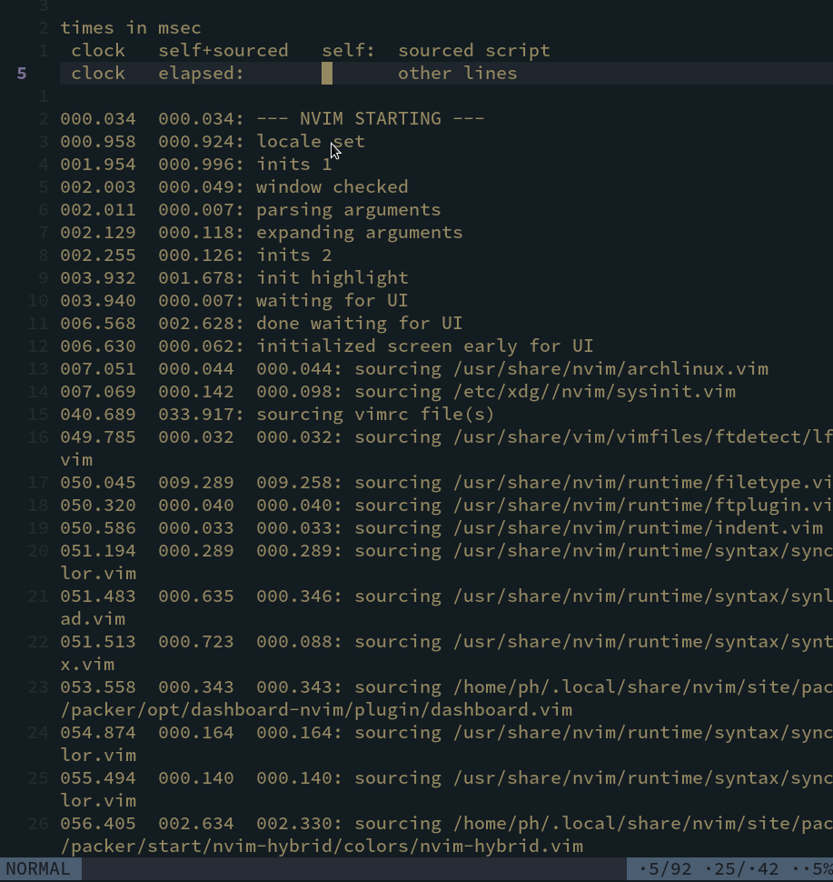
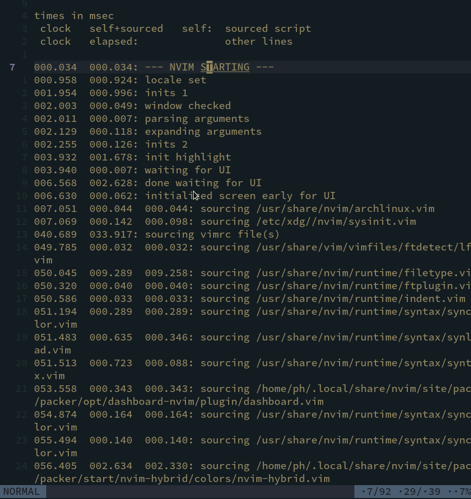

# faster.nvim
A neovim plugin to accelerate j or k moving.

# Screenshot
 
 

# Usage
It only testing with the neovim plugin management.
```lua
use{
  "PHSix/faster.nvim",
  event = {"VimEnter *"},
  config = function()
    vim.api.nvim_set_keymap('n', 'j', '<Plug>(faster_move_j)', {noremap=false, silent=true})
    vim.api.nvim_set_keymap('n', 'k', '<Plug>(faster_move_k)', {noremap=false, silent=true})
  end
}
```

	
# Inspiration
[rhysd/accelerated-jk](https://github.com/rhysd/accelerated-jk)

